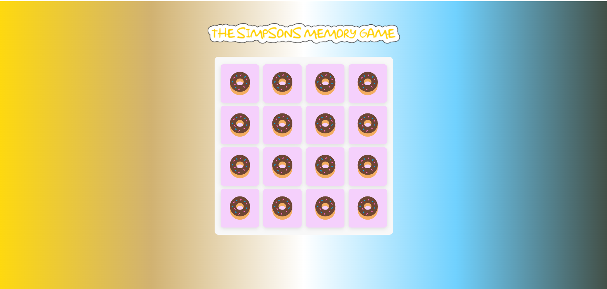
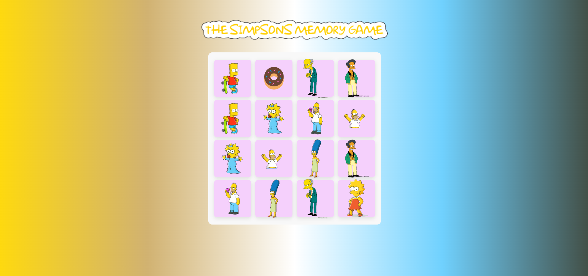

# Memory Card Game

## Description
Memory Card Game

This repository contains the source code for a simple Memory Card Game built using HTML, CSS, and JavaScript. The game involves a grid of cards, each with a hidden image on one side. The goal is to find matching pairs of cards by flipping them over two at a time. The game is won when all pairs have been successfully matched.

How to Play
Click on a card to reveal its hidden image.
Click on another card to find its matching pair.
If the two cards match, they remain flipped. If not, they are flipped back after a brief animation.
Continue finding matching pairs until all cards are matched.

Features
Interactive UI: The game provides an interactive user interface with clickable cards.
Card Shuffle: The cards are randomly shuffled at the beginning of each game.
Matching Logic: The game checks for matching pairs and updates the gameplay accordingly.
Animation: The cards feature a flip animation when selected or when mismatched.

Project Structure
HTML File: Contains the structure of the web page, including the card elements and necessary dependencies.
CSS File: Defines the styling and layout of the game, including animations and responsiveness.
JavaScript File: Implements the game logic, including card flipping, matching, and shuffling.

# Installation
N/A

## Usage
The following image shows the challange appearance and functionality:

## Deployment
Live URL: https://costea47.github.io/Memory-Game/
GitHub Repository: https://github.com/Costea47/Memory-Game/

## License
This project is licensed under the MIT License.